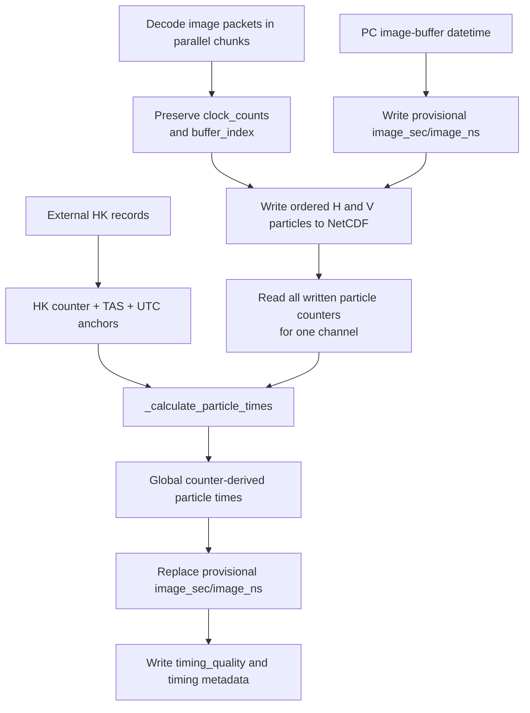
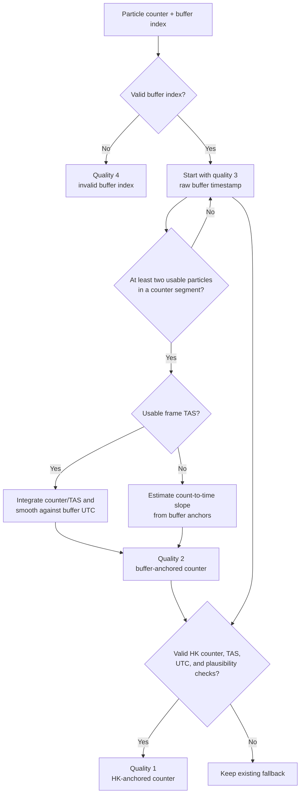
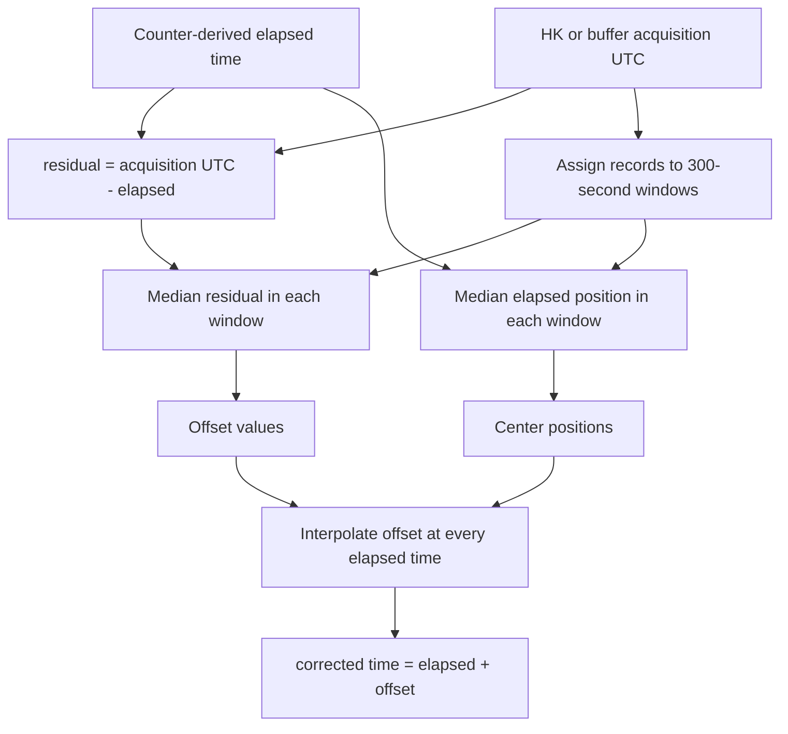
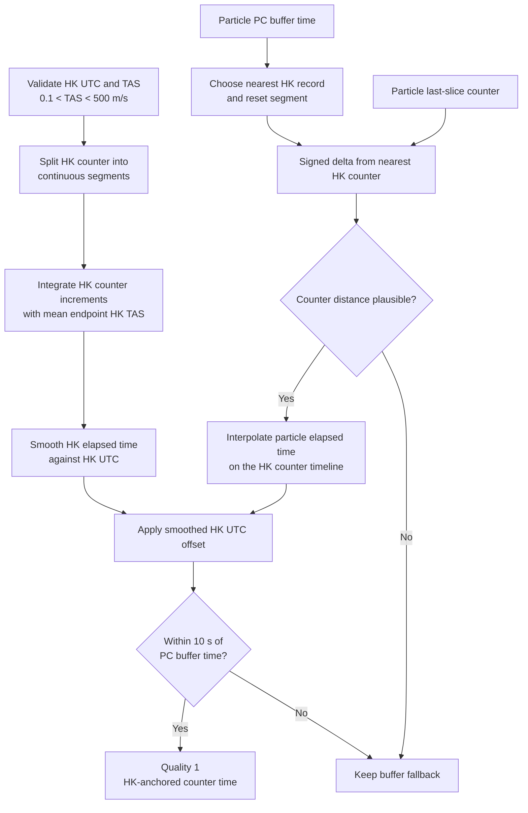

# SPEC Fast 2D-S particle-time decoding

This document describes how `Fast2DSFile` calculates particle timestamps for
SPEC Fast 2D-S Type 48 data. The implementation is in
[`nrc_spifpy/input/fast_2ds_file.py`](../nrc_spifpy/input/fast_2ds_file.py),
primarily in [`_calculate_particle_times`](../nrc_spifpy/input/fast_2ds_file.py#L1102)
and its timing helpers.

The standard SPEC 2D-S, HVPS, and HVPS-4 timing method is documented separately
in [`SPEC_probe_time_decoding.md`](SPEC_probe_time_decoding.md).

## Purpose

Fast 2D-S provides several imperfect but complementary time sources:

- The particle packet contains a free-running 48-bit probe counter measured at
  the last image slice. It gives precise relative timing but no UTC by itself.
- The external housekeeping (`.F2DSHK`) file contains counter, TAS, and UTC
  records. These are the preferred counter-to-UTC anchors.
- Each 4-kB image buffer has a PC timestamp. It is coarser and noisier than the
  probe counter, but remains available when housekeeping is absent or invalid.

The decoder preserves the counter's fine particle-to-particle timing, anchors
it to housekeeping UTC where possible, and assigns a source-quality flag to
every output timestamp.

## Timing inputs and outputs

| Value | Source | Role |
|---|---|---|
| Particle `clock_counts` | Final three timing words of an image packet | 48-bit counter at the particle's last slice |
| `hk_counts` | External HK words at array positions 72-74 | 48-bit counter anchors |
| `hk_tas` | External HK words at array positions 75-76 | TAS used to convert HK counter increments to time |
| `hk_datetimes` | External HK record headers | Preferred UTC anchors |
| Frame `tas` | HK TAS interpolated to image-buffer timestamps | Counter conversion for the buffer fallback |
| `buffer_index` | Decoded particle metadata | Maps each particle to its 4-kB PC buffer |
| `self.datetimes` | Image-buffer headers | Coarse PC UTC fallback |
| `clock_resolution_um` | `Fast2DSFile` constructor, default 10 micrometres | Flight distance represented by one counter count |

The final NetCDF variables are:

- `image_sec`: integer seconds relative to `start_date`
- `image_ns`: normalized nanoseconds within `image_sec`
- `clock_counts`: the original 48-bit last-slice counter stored as `uint64`
- `timing_quality`: a `uint8` flag identifying the selected timing path

## Two-stage processing design

Fast 2D-S image decoding runs in parallel 500-frame chunks. Particle timing is
therefore finalized in two stages so worker boundaries do not reset the global
counter timeline.



[`extract_images`](../nrc_spifpy/input/fast_2ds_file.py#L1229) initially assigns
each particle its parent buffer timestamp and quality 3. After all chunks have
been written in frame order, [`_finalize_particle_times`](../nrc_spifpy/input/fast_2ds_file.py#L1157)
reads the complete channel, calculates one global timeline, and overwrites the
provisional values.

## Timing-quality hierarchy

The calculation begins with a complete fallback timeline, then replaces
particles only when a higher-quality source passes its validation checks.

| Flag | NetCDF meaning | Time source |
|---:|---|---|
| `1` | `hk_anchored_probe_counter` | 48-bit particle counter anchored by HK counter, TAS, and UTC |
| `2` | `buffer_anchored_probe_counter` | Particle counter anchored by PC buffer timestamps |
| `3` | `buffer_timestamp` | Raw parent-buffer timestamp; no accepted counter solution |
| `4` | `invalid_buffer_index` | Buffer index is outside the available frame range |



## Read the external housekeeping anchors

[`_align_hk_to_frames`](../nrc_spifpy/input/fast_2ds_file.py#L220) validates HK
calendar fields and builds nanosecond-resolution `hk_datetimes`. It reconstructs
the 48-bit HK counter as:

```python
hk_counts = (
    (hk_words[:, 72].astype(numpy.uint64) << 32)
    | (hk_words[:, 73].astype(numpy.uint64) << 16)
    | hk_words[:, 74].astype(numpy.uint64)
)
```

The two TAS words are combined into an IEEE-754 `float32` value and converted
to `float64`. TAS values between 0 and 500 m/s are interpolated to the PC image
buffer times for use by the buffer-counter fallback. The original HK counter,
TAS, and UTC arrays remain available for the preferred timing calculation.

If the HK file is missing, malformed, contains no valid timestamps, or contains
no valid TAS, the decoder retains the buffer-based fallback paths.

## 48-bit counter arithmetic

### Signed modular differences

[`_signed_counter_delta`](../nrc_spifpy/input/fast_2ds_file.py#L696) calculates
the shortest signed difference between two 48-bit counter values:

```python
half = 2**47
signed_delta = (current - previous + half) % 2**48 - half
```

This makes a normal rollover remain a small positive increment:

```text
Previous count:  2^48 - 5,000,000
Current count:              5,000,000
Signed delta:              10,000,000
```

A zero or negative signed delta indicates a duplicate, reversal, or reset rather
than a normal rollover.

### Continuous counter segments

[`_counter_segments`](../nrc_spifpy/input/fast_2ds_file.py#L780) starts a new
segment when:

- the signed counter difference is zero or negative, or
- the corresponding acquisition timestamp moves backward.

Segments shorter than two records cannot define an interarrival time and remain
on the lower-quality fallback.

[`_unwrap_counter`](../nrc_spifpy/input/fast_2ds_file.py#L704) then converts
each accepted segment to increasing integer counts. Any non-positive increment
causes that segment to be rejected.

## Convert counter increments to elapsed time

[`_counter_elapsed_seconds`](../nrc_spifpy/input/fast_2ds_file.py#L718) uses the
mean TAS at the two endpoints of every counter interval:

```python
mean_tas = 0.5 * (tas[:-1] + tas[1:])
interval_seconds = (
    count_delta
    * clock_resolution_um
    * 1.0e-6
    / mean_tas
)
```

In physical units:

```text
Delta time = Delta count x counter resolution / mean endpoint TAS
```

For example:

```text
Delta count:          10,000,000
Counter resolution:          10 micrometres/count
Flight distance:             100 m
Endpoint TAS:                100 and 200 m/s
Mean TAS:                    150 m/s
Delta time:                  2/3 s
```

The intervals are cumulatively summed to produce a smooth elapsed-time axis for
the segment.

## Smooth counter time toward an acquisition clock

[`_smoothed_timing_offset`](../nrc_spifpy/input/fast_2ds_file.py#L795) aligns a
counter-derived elapsed-time axis with either HK UTC or PC buffer UTC.



For every five-minute window, the function returns:

- the median counter-derived elapsed time as the interpolation center, and
- the median `acquisition_seconds - elapsed` residual as the UTC offset.

Medians suppress individual acquisition-timestamp jitter. Interpolation makes
the correction vary gradually between windows, so short particle interarrival
times continue to come from the probe counter.

Unlike the standard SPEC `_smoothed_buffer_offset` method, this helper does not
select only the final particle in each PC buffer. It uses every acquisition
record in the segment: every valid HK record on the preferred path, or every
particle with its repeated parent-buffer timestamp on the TAS-based fallback.
The window median dampens isolated timestamp jitter, although buffers with
more particles contribute more repeated observations.

## Preferred path: HK-anchored probe-counter timing

[`_apply_hk_counter_timing`](../nrc_spifpy/input/fast_2ds_file.py#L963) replaces
the buffer-derived baseline where valid HK anchors are available.



### Select the correct reset segment

Counter values can repeat after a reset. The coarse PC buffer time is therefore
used to find the nearest HK timestamp and identify which continuous HK segment
contains the particle.

### Place the particle on the HK counter timeline

The signed 48-bit difference between the particle counter and the selected HK
counter is added to the unwrapped HK count. Particle elapsed time is then
interpolated between HK counts. Nearby particles outside the first or last HK
count use the endpoint TAS for limited extrapolation.

### Reject implausible associations

Before accepting an HK association, the counter distance expressed as seconds
must be no larger than:

```python
max(
    10.0,
    abs(particle_buffer_time - selected_hk_time) + 2.0,
)
```

After applying the smoothed HK offset, the final time must also remain within
10 seconds of the particle's PC buffer time. Particles that fail either check
retain their buffer-derived fallback.

## Fallback path: buffer-anchored probe-counter timing

[`_buffer_counter_fallback`](../nrc_spifpy/input/fast_2ds_file.py#L876) creates a
complete baseline before the HK path is attempted.

### With valid frame TAS

When every particle in a segment maps to a finite frame TAS between 0.1 and
500 m/s:

1. The particle counter is unwrapped.
2. Counter increments are integrated using mean endpoint frame TAS.
3. The resulting elapsed time is aligned to the repeated PC buffer timestamps
   with `_smoothed_timing_offset`.
4. Calculated times within 10 seconds of their buffer timestamps receive
   quality 2.

This path preserves counter-based interarrival timing while slowly following
the PC clock.

### Without usable frame TAS

[`_times_from_buffer_anchors`](../nrc_spifpy/input/fast_2ds_file.py#L820)
estimates a count-to-time relationship directly from consecutive PC buffers:

1. Group particles by `buffer_index`.
2. Use the median unwrapped particle count in each buffer as `anchor_counts`.
3. Pair it with that buffer's PC timestamp as `anchor_seconds`.
4. Retain only anchors whose counts and timestamps both increase.
5. Interpolate time as a function of count between the anchors.
6. Use the first or last anchor-pair slope for endpoint extrapolation.

At least two increasing buffer anchors are required. Accepted times must remain
within 10 seconds of their parent buffer timestamp and receive quality 2.

### Raw buffer timestamp

Particles that cannot obtain a plausible counter-derived solution retain the
parent PC buffer timestamp and quality 3. A single particle without HK data is
a common example because one point cannot establish a counter rate.

An out-of-range `buffer_index` has no valid timestamp and receives quality 4.

## Guard against backward particle times

[`_replace_backwards_times`](../nrc_spifpy/input/fast_2ds_file.py#L761) detects
adjacent timestamps that move backward by more than one microsecond. Both
particles surrounding the jump are replaced with the next-lower fallback and
their quality flags are downgraded accordingly.

This check is applied:

- after constructing the buffer-counter baseline, using raw buffer timestamps
  as the fallback, and
- after applying HK timing, using the saved buffer-counter baseline as the
  fallback.

## Convert and write the final NetCDF time

[`_seconds_to_sec_ns`](../nrc_spifpy/input/fast_2ds_file.py#L748) converts
floating-point seconds to normalized `image_sec` and `image_ns`. Non-finite
values are replaced with zero, and a rounded value of exactly
`1_000_000_000` ns carries one second into `image_sec`.

During finalization, the decoder also writes these metadata:

- `particle_timing_method`: documents the HK, buffer-counter, and raw-buffer
  hierarchy
- `particle_timestamp_reference`: `Time of the last slice in the particle image`
- `clock_resolution_um`: counter distance resolution used by the integration
- `image_sec:ancillary_variables`: `timing_quality clock_counts`
- `clock_counts` attributes documenting the modulo-`2**48` counter

The decoder prints the number of quality 1, 2, 3, and 4 particles separately
for the horizontal and vertical channels.

## Timing interpretation and limitations

- A quality flag identifies the calculation source, not independently verified
  UTC accuracy.
- The particle counter precisely measures distance counts, but conversion to
  time still depends on TAS.
- HK UTC is preferred, but HK timestamps are acquisition anchors rather than
  direct particle timestamps.
- PC buffer timestamps are coarse and shared by many particles. They are used
  both as fallbacks and as plausibility constraints.
- The 300-second median windows intentionally remove short-period acquisition
  clock jitter. They also make the absolute correction respond slowly.
- Short counter segments, counter duplicates/resets, invalid TAS, and
  implausible counter-to-clock associations cause local fallback rather than
  failure of the complete file.
- The timestamp represents the last slice of each particle image, matching the
  location of the packet's 48-bit timing value.

## Regression coverage

[`tests/test_fast2ds_timing.py`](../tests/test_fast2ds_timing.py) and
[`tests/test_fast2ds_regressions.py`](../tests/test_fast2ds_regressions.py)
cover:

- HK-anchored particle timing,
- mean-endpoint TAS integration,
- 48-bit rollover,
- immunity of counter interarrival time to HK timestamp jitter,
- missing-HK buffer-counter fallback,
- raw-buffer fallback for a single particle,
- buffer-derived count rate when TAS is absent,
- provisional buffer timestamps and quality flags,
- preservation of the full 48-bit counter in NetCDF, and
- little-endian image and NULL packet marker interpretation, and
- post-write finalization of `image_sec`, `image_ns`, and `timing_quality`.
