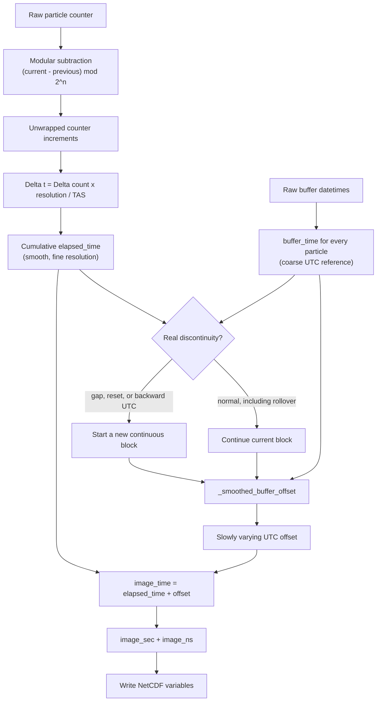
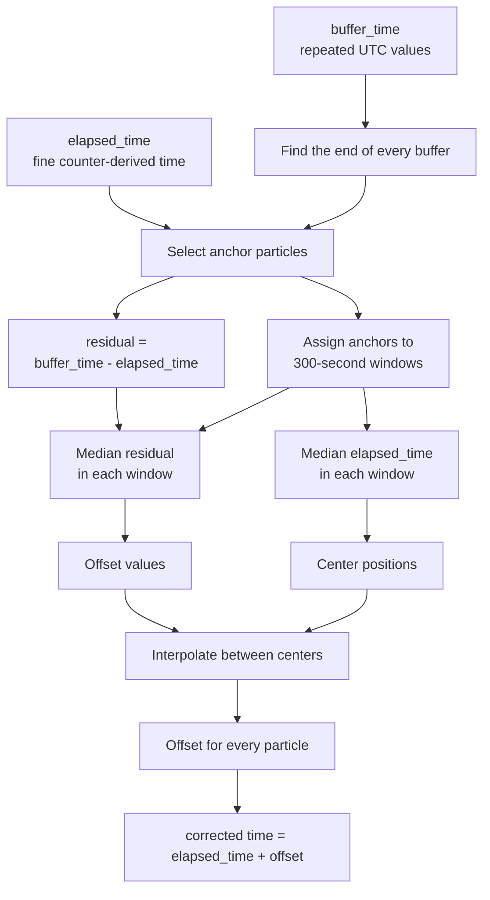

# SPEC probe particle-time decoding

This document describes how `SPECFile` calculates particle timestamps for the
SPEC 2D-S, HVPS, and HVPS-4 decoders. The implementation is in
[`nrc_spifpy/input/spec_file.py`](../nrc_spifpy/input/spec_file.py), primarily
in [`calc_image_times`](../nrc_spifpy/input/spec_file.py#L337) and its timing
helpers.

## Purpose

The implementation combines two imperfect clocks:

- `elapsed_time` is smooth, high-resolution particle timing derived from the
  probe counter. It can drift because the conversion from distance counts to
  time depends on measured true airspeed (TAS).
- `buffer_time` is the long-term UTC reference derived from PC buffer
  timestamps. It is coarse because every particle in a buffer initially shares
  the same timestamp.

The algorithm preserves the counter's fine particle-to-particle timing while
slowly correcting its drift toward buffer UTC.

## Supported probes and counter widths

| Instrument name | Counter modulus used by `SPECFile` |
|---|---:|
| `2DS` | `2**32` |
| `HVPS` | `2**32` |
| `HVPS4` | `2**48` |

The output variable `clock_counts` is stored as an unsigned 64-bit integer so
that both 32- and 48-bit raw counters retain their full precision.

## Inputs and outputs

For each instrument group, [`calc_image_times`](../nrc_spifpy/input/spec_file.py#L337)
uses the following values:

| Value | Source | Role |
|---|---|---|
| `clock_counts` | Particle core variable | Raw probe counter for every particle |
| `tas` | Particle core variable | Converts counter distance increments to elapsed time |
| `buffer_index` | Particle core variable | Maps every particle to its parent raw-data buffer |
| `self.datetimes` | Raw buffer headers | Provides the PC buffer UTC timestamps |
| `self.start_date` | Midnight on the first buffer's date | Defines zero seconds in the SPIF file |
| `self.resolution` | Instrument configuration | Distance represented by one counter count, in micrometres |

It replaces the provisional particle times in the NetCDF core group with:

- `image_sec`: integer seconds relative to `start_date`
- `image_ns`: normalized nanoseconds in the corresponding second

## Overall timing flow



A normal 32- or 48-bit rollover is resolved by modular subtraction, so it does
not start a new timing block.

## Execution sequence

### 1. Map buffer UTC to every particle

The buffer datetimes are first converted to floating-point seconds relative to
`start_date`:

```python
frame_time = (
    numpy.asarray(self.datetimes, dtype='datetime64[ns]')
    - numpy.datetime64(self.start_date)
) / numpy.timedelta64(1, 's')
```

Each particle's `buffer_index` then selects the timestamp of its parent buffer:

```python
buffer_time = frame_time[buffer_index]
```

Particles from the same buffer therefore begin with the same coarse time.

### 2. Fill missing TAS

[`_fill_missing_tas`](../nrc_spifpy/input/spec_file.py#L229) treats finite,
positive TAS values as valid. Missing or non-positive values are interpolated
by particle index from the nearest valid values. If all TAS values are invalid,
counter-based timing cannot be calculated and the function returns the original
`buffer_time` values.

### 3. Unwrap the hardware counter

[`_unwrap_counter`](../nrc_spifpy/input/spec_file.py#L210) evaluates consecutive
counter differences modulo the hardware counter width:

```python
delta_count = (current_count - previous_count) % modulus
```

For example, a 32-bit rollover remains continuous:

```text
Raw count:       2^32 - 20   2^32 - 10         0       10
Modular delta:                    10          10       10
Elapsed count:        0           10          20       30
```

The same calculation is used with a `2**48` modulus for HVPS-4.

### 4. Convert counter increments to elapsed time

One count represents one instrument-resolution element along the flight path.
For every particle:

```text
Delta time = Delta count x resolution x 10^-6 / TAS
```

where:

- `Delta count` is dimensionless,
- `resolution` is in micrometres per count,
- `10^-6` converts micrometres to metres, and
- `TAS` is in metres per second.

The increments are cumulatively summed within each continuous block to obtain
`elapsed_time`.

### 5. Separate true discontinuities

The implementation begins a new timing block when any of these conditions is
true:

| Condition | Interpretation |
|---|---|
| `delta_buffer > 200 s` | Real acquisition gap |
| `delta_buffer < 0 s` | PC buffer UTC moved backward |
| `delta_time > max(delta_buffer, 0) + 10 s` | Implausible counter jump or reset |

The 10-second allowance is `COUNTER_GAP_TOLERANCE_SECONDS`. Counter elapsed
time is restarted at zero for the first particle of each new block, and that
block receives its own smoothed UTC offset.

## `_smoothed_buffer_offset`

[`_smoothed_buffer_offset`](../nrc_spifpy/input/spec_file.py#L244) estimates the
slow correction that aligns counter-derived elapsed time with buffer UTC.



### 1. Find the last particle in each buffer

Suppose particles have these buffer timestamps:

```text
Particle index:   0    1    2    3    4    5
buffer_time:     10   10   10   11   11   12
```

The code evaluates:

```python
numpy.diff(buffer_time) != 0
```

giving:

```text
False, False, True, False, True
```

A `True` at position `i` means particle `i` is the last particle before the
buffer timestamp changes:

```text
Particle index:   0    1   [2]   3   [4]  [5]
buffer_time:     10   10   10    11   11   12
                            ^          ^    ^
                       anchors
```

The appended `[True]` ensures that the final particle is always included:

```python
anchor = numpy.flatnonzero(numpy.concatenate((
    numpy.diff(buffer_time) != 0,
    [True],
)))
```

### 2. Measure counter-clock drift

At each anchor:

```python
residual = buffer_time[anchor] - elapsed_time[anchor]
```

For example:

| Anchor | Counter time | Buffer UTC | Residual |
|---:|---:|---:|---:|
| 1 | 100.03 s | 100.00 s | -0.03 s |
| 2 | 200.05 s | 200.00 s | -0.05 s |
| 3 | 300.08 s | 300.00 s | -0.08 s |

The increasingly negative residual means the counter-derived timeline is
slowly running ahead of buffer UTC.

### 3. Divide anchors into five-minute windows

Anchors are assigned to fixed 300-second windows measured from the first
anchor's buffer time:

```python
window = numpy.floor(
    (anchor_buffer_time - first_anchor_buffer_time) / 300
)
```

```text
Window 0:   0-299.999 s
Window 1: 300-599.999 s
Window 2: 600-899.999 s
```

For each window, the function calculates:

- `centers`: median counter-derived elapsed time of the selected anchors
- `offsets`: median UTC residual of the selected anchors

Medians reduce sensitivity to individual noisy PC buffer timestamps.

### 4. Interpolate a gradual correction

Conceptually:

```text
UTC offset
   ^
 0 |   *
   |    \
   |     \
-.1|      *
   |       \
-.2|        *
   +------------------------> elapsed_time
center 0  1 2
```

After discarding non-increasing center positions, the line is evaluated at
every particle time:

```python
numpy.interp(elapsed_time, centers, offsets)
```

`numpy.interp` holds the first or last offset constant outside the available
center range. The returned `offset(t)` is a slowly changing correction, which
the caller applies as:

```python
image_time = elapsed_time + offset
```

Short particle-to-particle intervals therefore continue to come from the probe
counter, while the long-term timeline follows buffer UTC without abrupt
five-minute steps.

## Convert to SPIF seconds and nanoseconds

[`_split_seconds`](../nrc_spifpy/input/spec_file.py#L326) separates each
floating-point `image_time` into integer seconds and nanoseconds. Rounding that
produces exactly `1_000_000_000` ns carries one second into `image_sec`, keeping
the NetCDF representation normalized.

## Fallbacks and failure behavior

- Empty particle arrays return an empty copy of `buffer_time`.
- Partially missing TAS is interpolated before counter timing is calculated.
- If all TAS is missing or invalid, `image_time` remains equal to `buffer_time`.
- Normal 32- or 48-bit rollovers remain inside the current continuous block.
- Acquisition gaps, backward buffer UTC, and implausible counter jumps begin a
  new block so one bad interval does not contaminate the rest of the file.
- Input arrays with incompatible shapes raise `ValueError`.

## Timing interpretation and limitation

The method improves relative particle timing; it does not create an independent
absolute UTC measurement. PC buffer timestamps are acquisition/write-time
references, not direct measurements of the time of an individual particle.
Treating the final particle in each buffer as the anchor is therefore an
algorithmic convention.

The smoothed correction removes long-term counter/TAS drift and avoids abrupt
buffer-scale steps, but an external truth dataset can still reveal a nearly
constant absolute offset. Such an offset should be handled as an absolute-time
calibration question rather than removed from the probe-counter interarrival
timing.

## Regression coverage

[`tests/test_spec_timing.py`](../tests/test_spec_timing.py) covers:

- 32- and 48-bit modular rollover handling,
- continuity across rollover,
- gradual drift correction across 300-second anchor windows,
- acquisition-gap and counter-reset block boundaries,
- missing-TAS fallback,
- full 48-bit counter storage, and
- normalized `image_sec` and `image_ns` NetCDF output.
