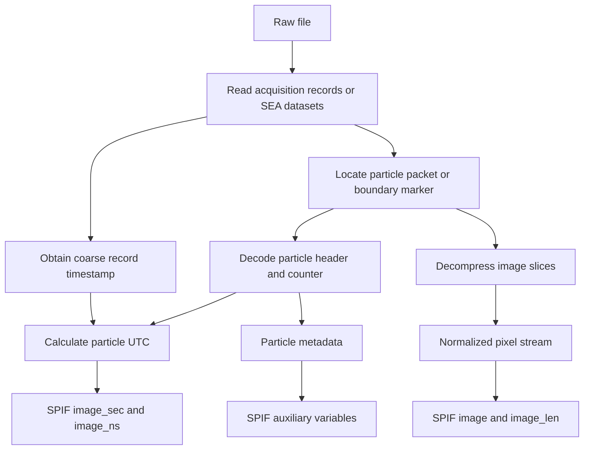
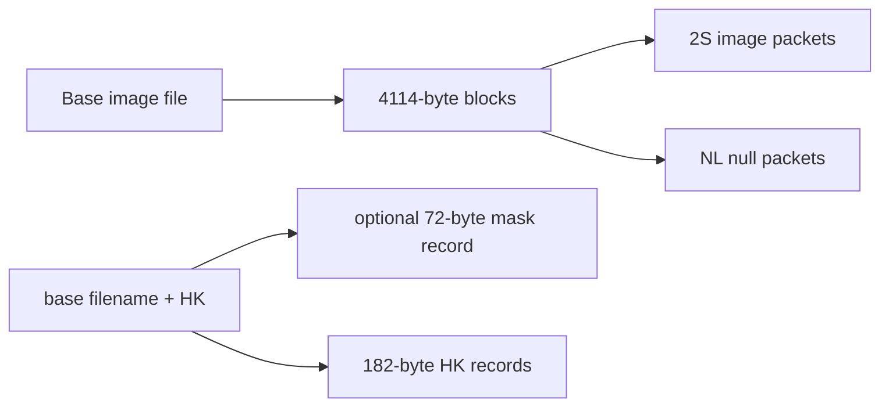

# Raw imaging-probe data formats supported by COPS-NRC-SPIFpy

This document describes the raw optical array probe (OAP) data formats that
the current COPS-NRC-SPIFpy command-line decoder accepts. It combines the
manufacturer format manuals with the behavior of the active source code.

The format manuals define what the instruments write. The active Python and
Cython decoders define what this repository currently recognizes and emits.
Where they differ in representation, this document shows both and identifies
the implementation behavior.

This is a raw-input guide, not a definition of the SPIF NetCDF output format.
For the output schema, see [the SPIF definition](SPIF_definition.tex). For
particle-time handling, see
[SPEC probe time decoding](SPEC_probe_time_decoding.md) and
[Fast 2D-S time decoding](SPEC_Fast2DS_time_decoding.md).

## Supported format families

The active dispatch table is in
[`nrc_spifpy/scripts/extract.py`](../nrc_spifpy/scripts/extract.py). The
instrument geometry shown below is supplied by the package configuration
files; it is generally not self-describing in the raw image records.

| CLI instrument | Active decoder | Raw format family | Array and configured resolution | Input container |
|---|---|---|---|---|
| `2DC` | `TwoDFile` | PMS two-dimensional monoscale | 32 pixels, 50 um | SEA M200/M300 |
| `2DP` | `TwoDFile` | PMS two-dimensional monoscale | 32-pixel decoder; no bundled `2DP.ini` | SEA M200/M300 |
| `CIP` | `DMTMonoFile` | DMT monoscale | 64 pixels, 15 or 25 um | PADS image file or SEA |
| `PIP` | `DMTMonoFile` | DMT monoscale | 64 pixels, 100 um | PADS image file or SEA |
| `CIPGS` | `DMTGreyFile` | DMT 2-bit grayscale | 64 pixels, 15 um | PADS image file or SEA |
| `2DS` | `SPECFile` | SPEC Type32 | two 128-pixel arrays, 10 um | SPEC base file |
| `HVPS` | `SPECFile` | SPEC Type32-style packet stream | 128 pixels, 150 um | SPEC base file |
| `HVPS4` | `SPECFile` | SPEC Type48-style timing | four output arrays at 50 and 150 um | SPEC base plus external HK |
| `Fast2DS` | `Fast2DSFile` | SPEC Type48 | two 128-pixel arrays, 10 um | SPEC base plus external HK |

The repository also imports `DMTGreyMonoFile`. It is selected only when the
configuration sets `mono_as_grey = true`; it decodes the grayscale stream and
maps its stored levels to a monoscale representation.

## Common decoding model

Despite different wire formats, the decoders all perform the same logical
operations:



Unless noted otherwise, the normalized one-bit image convention is:

- `0`: shadowed diode, particle present
- `1`: illuminated/clear diode

For CIP-GS, each pixel instead has a two-bit level from `0` (darkest) to `3`
(clear).

## SPEC base-file container

Standard 2D-S, HVPS-family, and Fast 2D-S base files use the same outer block
size. A file is a sequence of fixed 4,114-byte data blocks:

```text
+----------------------+--------------------------+------------------+
| PC timestamp         | raw data frame           | checksum         |
| 16 bytes / 8 words   | 4096 bytes / 2048 words | 2 bytes / 1 word |
+----------------------+--------------------------+------------------+
                         total = 4114 bytes
```

The active `SPECFile` and `Fast2DSFile` NumPy dtypes map the eight timestamp
words as follows:

| Word | Field | Notes |
|---:|---|---|
| 1 | year | four-digit year |
| 2 | month | 1-12 |
| 3 | day of week | 0 is Sunday, 6 is Saturday |
| 4 | day | day of month |
| 5 | hour | 0-23 |
| 6 | minute | 0-59 |
| 7 | second | 0-59 |
| 8 | millisecond | 0-999 |

The acquisition computer prepends this timestamp when it writes a raw frame
to disk. It is therefore a coarse acquisition or buffer reference, not the
time of every particle in the frame. The final word is read by the current
decoders but is named `discard` or `checksum`; it is not validated.

The 4,096-byte raw frame is a stream of variable-length packets. A packet can
cross a 4,114-byte block boundary. The decoders therefore inspect the next raw
frame when a packet is incomplete at the end of the current frame.

### Packet identifiers and byte order

The SPEC manual prints a logical ASCII identifier and a byte-swapped/on-disk
form for each packet type:

| Packet | Logical word | Manual's parenthesized on-disk form | Contents |
|---|---:|---:|---|
| `2S` | `0x3253` | `0x5332` | image data |
| `HK` | `0x484B` | `0x4B48` | housekeeping |
| `MK` | `0x4D4B` | `0x4B4D` | mask data |
| `NL` | `0x4E4C` | `0x4C4E` | null/fill packet |

The parenthesized values show the byte order visible on disk. They should not
be used directly as native `uint16` comparison values. On a little-endian
host, disk bytes `53 32` are read as `0x3253`, while disk bytes `4C 4E` are
read as `0x4E4C`. The active decoders compare these resulting integer values:

- `SPECFile` compares `0x3253`, `0x484B`, and `0x4D4B` for image, HK, and mask
  packets.
- `Fast2DSFile` and its Cython decoder compare `0x3253` and `0x4E4C` for image
  and null packets.

Use the constants in the applicable decoder when diagnosing a particular raw
file.

## SPEC Type32: standard 2D-S and HVPS

A Type32 base frame can contain interleaved image (`2S`), housekeeping (`HK`),
mask (`MK`), and null (`NL`) packets. Newer acquisition systems may also write
a redundant external HK file, but `SPECFile` obtains standard 2D-S/HVPS
housekeeping from the embedded stream.

### Type32 image packet

```text
word 1      word 2      word 3      word 4       word 5       following N words
+---------+-----------+-----------+------------+------------+-------------------+
| "2S"    | NHraw     | NVraw     | particle   | slice      | channel payload   |
| header  | H flags/N | V flags/N | ID         | count      | plus time words   |
+---------+-----------+-----------+------------+------------+-------------------+
```

Only one of `NHraw` and `NVraw` normally has a nonzero word count, identifying
the horizontal or vertical channel. In both words the lower 12 bits give `N`,
the number of channel words after the five-word header.

| Bit | Manufacturer meaning | `SPECFile.decode_flags` name |
|---:|---|---|
| 15 | FIFO overflow / overload information | `overload` |
| 14 | channel/FIFO status; array selector for HVPS4 | `fifo_array` |
| 13 | timing mismatch/status | `mismatch` |
| 12 | multi-packet image; no timing words in this packet | `timing` |
| 11-0 | payload word count | `n` |

The particle ID is a 16-bit counter. A large particle can occupy multiple
packets; those packets share the particle ID. The slice-count word describes
the number of 128-pixel slices in the fully decompressed image.

For a final Type32 packet, the last two channel words form the 32-bit
`probecount` for the last image slice. The active decoder combines them as:

```text
counter = (penultimate_word << 16) | final_word
```

Packets with bit 12 set do not terminate the particle and do not carry these
time words.

### Type32 image compression

Type32 image data are always run-length encoded. A general compression word
has this layout:

```text
15        14        13                 7 6                       0
+---------+---------+-------------------+-------------------------+
| unused  | start   | shaded pixel count| clear pixel count       |
| 0       | slice   | 7 bits            | 7 bits                  |
+---------+---------+-------------------+-------------------------+
```

Within each slice, the run begins with clear pixels, followed by shaded
pixels. More words continue the alternating runs until a new `start slice`
flag or special word begins the next slice. An incomplete slice is padded as
clear by the active decoder.

Two special words are defined:

| Word | Type32 meaning | Decoder behavior |
|---:|---|---|
| `0x4000` | one completely shaded 128-pixel slice | emits 128 shadowed pixels |
| `0x7FFF` | nominal completely clear slice; manual says it is not used | emits 128 clear pixels for Type32 |

### Type32 housekeeping and mask packets

The Type32 HK packet is 53 words and is normally written at about 1 Hz among
the image packets. It contains detector voltages, temperatures, power-supply
values, pressure, laser drive, mask counts, diagnostic counters, TAS, and
timing words. `spec_utils.py` locates `HK` words and converts supported fields
with the manufacturer coefficients before writing `aux-housekeeping`.

The mask packet is 23 words in Type32. It includes the mask-active counter,
128 horizontal and 128 vertical mask bits, and start/end counters for the mask
routine. A mask bit of `0` means masked and `1` means not masked.

### HVPS4 implementation differences

When the configured name is `HVPS4`, `SPECFile` changes three parts of the
interpretation:

- particle timing uses three payload words as a 48-bit counter;
- `0x7FFF` introduces eight uncompressed 16-bit words, or one 128-pixel raw
  slice;
- bit 14 selects the fine or coarse array, producing H50, V50, H150, and V150
  output groups.

The decoder also reads TAS from an external file named by appending `HK` to
the base filename. These are implementation-specific HVPS4 branches in
`SPECFile`; the Type32 tables above should not be assumed for those changed
fields.

## SPEC Type48: Fast 2D-S

Fast 2D-S separates image and housekeeping data:



The SPEC manual uses `.2DSD` and `.2DSDHK` names. Data in this project may use
`.F2DS` and `.F2DSHK`, and the filename extension is not used to select the
parser. `Fast2DSFile` simply opens the user-supplied base file and looks for a
companion whose full name is `base_filename + "HK"`.

### Type48 image packet

The five-word header and `NHraw`/`NVraw` flags are the same logical layout as
Type32. The differences are in image encoding and the final counter:

- image packets can mix run-length encoded and raw slices;
- the last three words of a final packet encode the 48-bit counter of the last
  slice;
- a multi-packet segment has bit 12 set and contains image words only;
- all segments of a multi-packet particle share the 16-bit particle ID.

The active Fast decoder combines a final packet's last three words in
least-to-most-significant order:

```text
counter = low_word | (middle_word << 16) | (high_word << 32)
```

It holds incomplete particles by particle ID until a segment arrives with bit
12 clear. A packet can be assembled from the current and one look-ahead raw
frame. A packet requiring more than those two frames is rejected with a
warning.

### Type48 image encoding

| Word | Type48 meaning |
|---:|---|
| `0x4000` | one completely shaded 128-pixel slice |
| `0x7FFF` | the following eight 16-bit words are one uncompressed slice |
| other | RLE word: bit 14 starts a slice, bits 13-7 count shaded pixels, bits 6-0 count clear pixels |

In an uncompressed slice, each of the eight words contributes 16 pixels,
least-significant bit first. The probe encoding uses `1` for clear and `0` for
shadow. The decoder normalizes the final SPIF image to that same clear/shadow
convention after its internal decompression state is assembled.

### Fast 2D-S external housekeeping file

A Fast 2D-S HK record is 182 bytes:

```text
+--------------------+----------------------+------------------+
| PC timestamp       | HK packet            | checksum         |
| 16 bytes           | 164 bytes / 82 words | 2 bytes          |
+--------------------+----------------------+------------------+
```

The HK packet begins with `HK` and a length word whose documented value is 83
(the header plus 82 data words). Important one-based manufacturer word
positions are:

| HK word | Field | Active zero-based index |
|---:|---|---:|
| 73 | counter bits 47-32 | 72 |
| 74 | counter bits 31-16 | 73 |
| 75 | counter bits 15-0 | 74 |
| 76-77 | TAS, 32-bit float | 75-76 |
| 17 | DSP-board temperature raw value | 16 |
| 22 | power-supply temperature raw value | 21 |

The active decoder applies `temperature_C = raw * 0.07323 - 64.8` for those
two temperature channels.

The file may begin with one 72-byte mask record:

```text
16-byte timestamp + 54-byte mask packet + 2-byte checksum
```

The decoder identifies this optional prefix from `file_size % 182`. It then
reads the remaining file as fixed 182-byte HK records. It does not currently
validate either checksum.

For a detailed explanation of how the 48-bit image/HK counters, TAS, and PC
timestamps are combined, see
[Fast 2D-S time decoding](SPEC_Fast2DS_time_decoding.md).

## DMT PADS record container

DMT CIP, PIP, and CIP-GS PADS image files use fixed 4,112-byte records:

```text
+----------------------+--------------------------------+
| TIME_FIELDS          | compressed image buffer        |
| 16 bytes / 8 uint16  | 4096 bytes                     |
+----------------------+--------------------------------+
                         total = 4112 bytes
```

The timestamp fields are ordered:

```text
year, month, day, hour, minute, second, millisecond, weekday
```

The raw integers are little-endian in the DMT example. There is no checksum
word in the PADS record: the DMT manual states that the synchronous interface
handles CRC checking in hardware.

`DMTMonoFile` also tolerates legacy records containing 1-32 dummy bytes
between `TIME_FIELDS` and the 4,096-byte image buffer. It retries these padded
record sizes only if the canonical layout does not produce valid timestamps.

PADS image filenames commonly begin with `Imagefile` and have companion
`Imageindex` files. COPS-NRC-SPIFpy reads the image records directly; it does
not require the index file.

### DMT data inside SEA files

For a filename ending in `.sea`, the DMT decoder does not assume contiguous
PADS records. The SEA reader parses the embedded acquisition tables and
selects datasets by acquisition type:

| SEA acquisition type | Value | Decoder use |
|---|---:|---|
| CIP image | 78 | 4,096-byte CIP/PIP monoscale buffers |
| advanced 2-D grayscale | 66 | CIP-GS buffers |

The enclosing SEA time dataset supplies the record timestamp. Once extracted,
the same DMT particle decompressor handles the 4,096-byte payload.

## DMT monoscale: CIP and PIP

### Buffer-level RLE

Each 4,096-byte compressed buffer is a sequence of run-length encoding header
bytes (RLEHBs) and optional literal bytes:

```text
bit       7       6       5       4                  0
        +-------+-------+-------+----------------------+
RLEHB   | Z     | O     | D     | count                |
        +-------+-------+-------+----------------------+
```

`count + 1` is the number of bytes represented by the header.

| Flag state | Meaning |
|---|---|
| `Z = 1` | emit `count + 1` zero bytes |
| `O = 1` | emit `count + 1` `0xFF` bytes |
| `D = 1` | dummy header; emit nothing |
| `Z = O = D = 0` | copy the next `count + 1` literal bytes |

The manufacturer format begins each acquired image buffer with an RLEHB, but
a 4,096-byte buffer can begin in the middle of a particle. Particle detection
therefore occurs after decompression.

The active `DMTMonoFile` searches across the current and next buffers for
particle boundary markers, then decompresses the ranges between them. This
preserves particles that span a record boundary and is tolerant of cases where
the first byte of the selected raw range is not itself a normal RLEHB.

### Particle boundary, header, and image

Eight bytes of `0xAA` form a 64-bit alternating-bit particle boundary. The
next eight bytes are the particle header:

| Header content | Size | Meaning |
|---|---:|---|
| particle count | 16 bits | wraps from 65,535 to 0; jumps can indicate dropped particles |
| real-time clock | 40 bits | time at which the particle ends, least-significant byte first |
| depth-of-field flag | 1 bit | active high |
| slice count | 7 bits | number of 64-pixel slices including the terminal clear/boundary convention |

The 40-bit real-time clock contains:

| Field | Bits | Resolution/range |
|---|---:|---|
| hour | 5 | 24-hour clock |
| minute | 6 | 0-59 |
| second | 6 | 0-59 |
| millisecond | 10 | 0-999 |
| sub-millisecond count | 13 | 125 ns per count |

Following the header are 64-bit image slices. The manufacturer specifies byte
reversal within each eight-byte slice for display/analysis. Image bits use `0`
for a shadowed diode and `1` for an illuminated diode. `DMTMonoFile` writes
the particle count and DOF flag as auxiliary variables and derives particle
time from the header clock, not from the coarse PADS record timestamp.

## DMT grayscale: CIP-GS

CIP-GS uses the same PADS/SEA record container but encodes a continuous stream
of two-bit pixel levels.

### Grayscale stream compression

If bit 7 of a compressed byte is set, bits 6-0 give the number of repetitions
of the most recently decoded two-bit value. Otherwise, the prefix selects how
many two-bit values are packed into the byte:

| Prefix | Payload |
|---|---|
| `01` | three two-bit values |
| `0001` | two two-bit values |
| `000001` | one two-bit value |
| leading `1` | repeat the preceding two-bit value by the seven-bit count |

After decompression, at least 128 consecutive values of `3` identify a
particle boundary. The active decoder advances past the full run of `3`s and
interprets the following 64 two-bit values as the 128-bit particle header.

### Grayscale particle layout

Each particle contains a header slice, image slices, and two all-clear trailer
slices. After the specified adjacent-bit-pair reversal, the 128-bit header is:

| Bits | Field |
|---|---|
| 127-120 | 8-bit slice count |
| 119-115 | hour |
| 114-109 | minute |
| 108-103 | second |
| 102-93 | millisecond |
| 92-83 | microsecond |
| 82-80 | eighths of a microsecond |
| 79-64 | 16-bit particle count |
| 63-56 | TAS in m/s |
| 55-0 | zero fill |

Each image slice contains 64 two-bit diode values:

| Value | Meaning |
|---:|---|
| `3` (`11`) | no shadow |
| `2` (`10`) | first shadow level |
| `1` (`01`) | second shadow level |
| `0` (`00`) | darkest shadow |

`DMTGreyFile` writes the header TAS and particle count with the image. The
number of pixels and the physical resolution still come from the selected
configuration file.

## PMS 2DC/2DP in SEA M200/M300

The active PMS decoder supports 2DC/2DP data only through the SEA container.
It uses the SEA acquisition table to select:

| SEA dataset | Type/value | Use |
|---|---:|---|
| 2-D mono image | 5 | 1,024 `uint32` image words per record |
| 2-D mono TAS factors | tag 6 in the decoder | TAS calculation |
| SEA time | tag 0 | coarse record timestamp |

Within the extracted image payload, `TwoDFile` recognizes the 32-bit sync word
`0x55000000` when it is preceded by the expected all-one marker pattern. A
particle is the sequence of 32-bit image words between successive sync
markers, excluding the word immediately before the next sync.

The lower 24 bits of that excluded word are the particle timeword:

```text
timeword = word_before_next_sync & 0x00FFFFFF
```

The decoder unwraps decreases as 24-bit rollover events within the SEA record.
It converts counter differences to elapsed time using TAS and configured pixel
resolution:

```text
seconds_per_count = resolution_m / TAS_m_per_s
particle_time = SEA_record_time + delta_count * seconds_per_count
```

Each remaining 32-bit word becomes one 32-pixel image slice in most-
significant-bit-first order. The active code derives TAS from the two values in
the SEA TAS-factor dataset. Because there is no bundled `2DP.ini`, a 2DP run
requires an appropriate user-supplied configuration.

## Implementation boundaries and diagnostics

These details are important when checking an unfamiliar raw file:

1. **Configuration selects the decoder.** The filename extension does not
   generally identify the instrument. `instrument_name` in the INI file drives
   the dispatch table; only DMT's `.sea` suffix changes the container reader.

2. **Geometry is metadata, not a discovered field.** Pixel count, resolution,
   arm separation, and bits per pixel come from the chosen INI file. Selecting
   the wrong configuration can yield structurally decodable but scientifically
   incorrect output.

3. **Native-endian assumptions remain.** Several active record dtypes use
   native `u2`/`u4` rather than explicit little-endian types. The currently
   supported data and development platforms are little-endian. Porting to a
   big-endian host requires an explicit byte-order audit.

4. **Checksums are not application-validated.** SPEC base and HK checksums are
   read but ignored. DMT's documented CRC is handled by acquisition hardware
   and is not stored in the 4,112-byte PADS image record.

5. **Buffer time is not particle time.** SPEC PC timestamps and SEA/PADS
   record timestamps identify acquisition records. Particle clocks or counters
   provide the fine timing whenever the format includes them.

6. **Packet and particle boundaries differ.** A large SPEC particle may span
   multiple packets and raw frames. A DMT particle may begin in one compressed
   buffer and finish in another. A parser that processes each 4,096-byte frame
   independently will lose such particles.

## Active source map

| Concern | Active source |
|---|---|
| CLI instrument-to-decoder selection | [`scripts/extract.py`](../nrc_spifpy/scripts/extract.py) |
| common fixed-record reader | [`input/binary_file.py`](../nrc_spifpy/input/binary_file.py) |
| SEA container and acquisition tables | [`input/sea.py`](../nrc_spifpy/input/sea.py) |
| SEA dataset selection and TAS factors | [`input/input_utils.py`](../nrc_spifpy/input/input_utils.py) |
| PMS 2DC/2DP particles | [`input/twod_file.py`](../nrc_spifpy/input/twod_file.py) |
| DMT PADS/SEA dispatch | [`input/dmt_binary_file.py`](../nrc_spifpy/input/dmt_binary_file.py) |
| DMT CIP/PIP monoscale | [`input/dmt_mono_file.py`](../nrc_spifpy/input/dmt_mono_file.py) |
| DMT CIP-GS grayscale | [`input/dmt_grey_file.py`](../nrc_spifpy/input/dmt_grey_file.py) |
| SPEC Type32 and HVPS4 branches | [`input/spec_file.py`](../nrc_spifpy/input/spec_file.py) |
| standard SPEC housekeeping conversion | [`input/spec_utils.py`](../nrc_spifpy/input/spec_utils.py) |
| Fast 2D-S file/HK/timing handling | [`input/fast_2ds_file.py`](../nrc_spifpy/input/fast_2ds_file.py) |
| optimized Fast 2D-S packet decoder | [`input/fast_2ds_decoder.pyx`](../nrc_spifpy/input/fast_2ds_decoder.pyx) |

The similarly named modules under `nrc_spifpy/input/spec/` and
`nrc_spifpy/input/dmt/mono/` are refactoring prototypes and are not imported by
the current package entry point. This guide follows the active top-level
modules listed above.

## References

The following external references were used during development. They are not
distributed with this repository. Page numbers refer to the displayed PDF
page numbers.

1. Stratton Park Engineering Company (SPEC), *SPEC OAP Data File Formats*,
   July 2022, Rev. D. In particular: section 3 and pages 8-14 for Type32;
   section 4 and pages 15-18 for Fast 2D-S Type48. Reference archive:
   `SPEC/SPEC_OAP_Data_File_Formats_July_2022_Rev_D.pdf`.
2. Droplet Measurement Technologies, *Image Probe Data Reference Manual*,
   DOC-0201 Rev. B, 2011. In particular: sections 5-7, pages 6-18, for DMT
   monoscale RLE, particle headers, grayscale encoding, and PADS records.
   Reference archive:
   `DMT/DMT_CIP_DOC-0201_Rev_B_Image_Probe_Data_Reference_Manual.pdf`.
3. *Fast 2DS Raw Data Format Specification*, a supplied external implementation
   note named `fast_2ds_format_specification.md`. It was used as a secondary
   cross-check; manufacturer tables and active code take precedence where
   representations differ.
4. SEA M200/M300 format behavior as implemented and documented in
   `nrc_spifpy/input/sea.py`, which points readers to chapter 3 of the SEA Model
   200 manual for the enclosing directory/dataset format.
